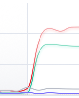

# Drupal.org — malicious traffic spike and automated blocking (community thread)

**Context:** Informal Drupal chat (Slack-style). Names and handles as in the original messages. **April 2026** incident window (traffic graph + blog-post timing in thread).

## What people saw

**nod_** shared a **sample traffic graph** from edge / WAF-style monitoring: for a long stretch the series sit near zero, then **several lines jump almost vertically** and **plateau**. In the poster’s legend, **red** is **blocked** requests and **green** is what **got through**—so most of the surge is **filtered**, but **allowed** traffic also rises in step. **nod_** framed it as *“some automated blocking is taking over”*—a glimpse of routine **flood** handling, not a full incident report.

## Thread (paraphrased)

### Scale — “could it be my bot?”

- **nod_:** Asked **what scale** the spike represented. They had been **working on a bot** with some **over-fetching** but doubted it could produce **anything like** that traffic.
- **drumm:** Unless you are paying for a **service that specifically proxies requests**, **it is not you**.
- **nod_:** **Not them**, then — **thanks** for the confirmation.
- **nnewton:** Lately the **pain** is **DDoS routed through residential proxies** **worldwide**, at a level **roughly 5×, 10×, or 20×** normal traffic (their wording). **Definitely not** the contributor’s bot; they **thanked** people for **checking**.

### Blog post, editing, and AI narrative

- **nod_:** Worried whether [**Gábor Hojtsy’s blog post**](https://www.hojtsy.hu/blog/2026-apr-10/solving-small-drupal-issue-plenty-added-tests-most-basic-claude-code-setup-without) (*10 Apr 2026* — small Drupal.org issue, tests, minimal **Claude Code** setup) **“opened the floodgates.”**
- **PapaGrande:** Ironic—they were **trying to edit a page** **because of that article.**
- **nicxvan:** **Similar patterns on GitHub** in their experience.
- **smustgrave:** Unclear whether the post **encourages AI summary updates and code submits** or it’s just **end-of-week** mood.
- **nod_ (meta):** For them the post was **“here’s what we can do with AI”** — not an open **call to flood** d.o., though some might read it that way.
- **James Shields:** **Creating a new project page** would **not happen that night**; thanks to people **resolving** the situation.
- **rhovland:** Asked whether **Fastly** offers a **proxied CAPTCHA challenge** mode (they find that **effective** against **DDoS** on **Cloudflare**).
- **nnewton** (later): **Not** **AI** or **AI scraping** for **this** event — **malicious** traffic (**edited** in original). (See **Scale** above for **volume** and **residential-proxy DDoS**.)
- **Gábor Hojtsy:** If the post **helps higher-quality AI contribution**, he’s **glad**; he doubts people who want to **flood** d.o. would **learn how from his post**.

## Links (canonical)

| Resource | URL |
|----------|-----|
| **Blog post** (Claude Code + d.o. issue workflow) | https://www.hojtsy.hu/blog/2026-apr-10/solving-small-drupal-issue-plenty-added-tests-most-basic-claude-code-setup-without |

## Use

**Citable context** when discussing **Drupal.org** under **attack traffic**, **edge blocking**, and **public AI tooling posts**: chat mixed **concern about volume** with an **in-thread correction** (**nnewton**) that a **given spike** was **malicious**, not **LLM scraping**; **Hojtsy** separated **good-faith AI contribution** from **flooding**. **drumm** / **nnewton** also **reassured** a contributor whose **personal bot** had **over-fetching** bugs: **paid proxy meshes** sit in a **different league** than **hobby automation**; recent attacks were described as **multiples of normal** (**5×–20×**) via **residential proxies**. This file is **not** a Drupal.org issue template (see `issues/` for those). For **PerimeterX** / **browser** challenges vs **Fastly** `/_fs-ch` on **api.d.o**, see [`issues/12-drupal-org-perimeterx-challenge-browsers.md`](../issues/12-drupal-org-perimeterx-challenge-browsers.md) and [`issues/07-api-drupal-org-fastly-interstitial-firefox.md`](../issues/07-api-drupal-org-fastly-interstitial-firefox.md).
