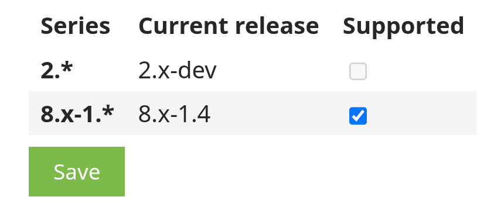

# Drupal.org “Supported” on release series — community Slack thread

**Context:** Drupal Slack discussion about the **Supported** checkbox on a project’s **release series** admin UI (contrib maintainer workflow).

## Screenshot (example UI)

## Thread (paraphrased)

- **Thread opener (Chi):** Why can’t they mark the **2.x** branch series as **Supported**? (See screenshot above.)
- **penyaskito:** Because there is **no proper release** yet—only a **`-dev`** snapshot.
- **Chi:** After adding a **beta** release, the **Supported** control was **still disabled / grey**. They noticed the series label shows **`2.0.*`** rather than **`2.*`**, and linked the broader policy discussion: [Drupal.org infrastructure #3436596 — *Release series should follow major version for contrib projects*](https://www.drupal.org/project/project/issues/3436596) (semantic versioning / how contrib series relate to **major.minor** vs core-style minors; related: [Drupal core #3357742](https://www.drupal.org/project/drupal/issues/3357742) for **core compatibility** guidance).
- **penyaskito:** **Personally** treats current behavior as **works as designed**, but agrees **wider clarification** from others is useful.
- **Neil Drumm (drumm):**
  > 2.x will only ever have the dev release, and dev releases are never really “supported” as far as end users are concerned. And having supported only on major.minor.x removes any question of what might take precedence in any situation.

## Links

| Resource | URL |
|----------|-----|
| Meta issue (release series / semver for contrib) | https://www.drupal.org/project/project/issues/3436596 |
| Core compatibility guideline (cross-reference in #3436596) | https://www.drupal.org/project/drupal/issues/3357742 |

## Use

Explain to maintainers why **`Supported` + `-dev`-only series** often do not line up, why **beta** may still not flip the UI the way people expect, and where the **policy conversation** lives on Drupal.org. This file is **not** a Drupal.org issue template (see `issues/` for those).
